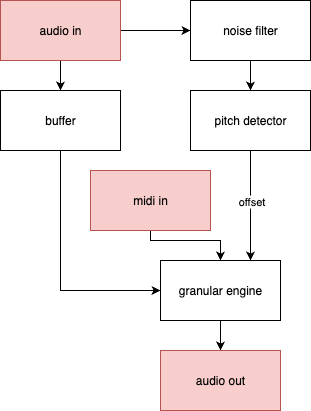
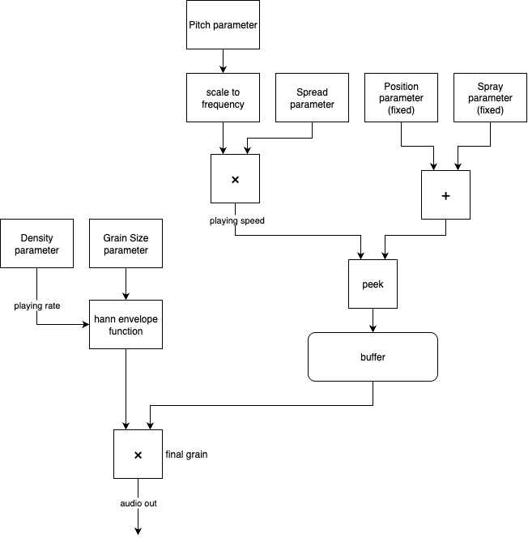

# Stratocumulus

*Stratocumulus* is a real-time audio plugin that transforms monophonic audio input into a polyphonic granular instrument.  
It combines a YIN-inspired fundamental frequency tracker with a granular synthesis engine driven by MIDI input, enabling harmonically consistent, performative control of live vocal or instrumental signals.

The project contains:

- A Max/MSP + RNBO patch
- A Max for Live (M4L) device
- A C++ export generated from the RNBO patch, suitable for building a JUCE plugin
- A JUCE/C++ plugin implementation built from the RNBO export

## Table of Contents

- [Introduction](#introduction)
  - [What is Stratocumulus?](#what-is-stratocumulus)
  - [Why it is special?](#why-it-is-special)
- [Signal Flow](#signal-flow)
  - [Audio & MIDI routing](#audio--midi-routing)
  - [Pitch tracking](#pitch-tracking)
  - [Granular engine](#granular-engine)
- [Requirements](#requirements)
  - [Repository structure](#repository-structure)
- [Build Instructions](#build-instructions)
  - [Max for Live (M4L) device](#max-for-live-m4l-device)
  - [JUCE implementation using the RNBO JUCE template](#juce-implementation-using-the-rnbo-juce-template)
  - [Current JUCE implementation in this repository](#current-juce-implementation-in-this-repository)
- [Main parameters](#main-parameters)
- [UI behavior (Max for Live only)](#ui-behavior-max-for-live-only)
- [Contact](#contact)

## Introduction

### What is Stratocumulus?

Stratocumulus is a performance-oriented audio effect/instrument that:

- Tracks the fundamental frequency of a monophonic input signal in real time using a YIN-inspired algorithm
- Uses that $f_0$ estimate to drive a **polyphonic granular synthesizer** controlled by MIDI
- In the Max for Live version, provides a responsive UI (orb visualizer + envelope view) that reflects density, grain size, stereo spread, and envelope shape in real time

The goal is to treat the live input (e.g., voice, melodic instrument) as the excitation for a playable granular instrument, rather than as a signal that is only processed by an insert effect.

### Why it is special?

- It’s designed as a **research/prototype tool** for exploring pitch-tracked granular harmony in real time.
- It uses a YIN-based pitch tracker tuned for **live performance**, with range constraints, confidence gating, and smoothing to keep the output stable and playable.
- It also integrates **real-time $f_0$ tracking**, **MIDI-driven polyphonic granular synthesis**, and a **performance-focused interface**, allowing performers—particularly vocalists working with keyboardists or sequencers—to articulate harmonies and textures in real time while preserving a clear relationship between source pitch and synthesized output.

## Signal Flow

Below is an overview of the main components and signal flow in Stratocumulus.



### Audio & MIDI routing

- A **monophonic audio source** (e.g., voice, cello, lead synth) is routed into the device.
- The input signal is written into a **circular buffer** shared by the analysis and synthesis stages.
- **MIDI note events** are sent to the same track:
  - MIDI notes define the *target pitches* that the granular engine should play.
  - These notes are converted to transposition ratios relative to the most recent reliable fundamental frequency estimate.

### Pitch tracking

- A YIN-inspired pitch detector runs on overlapping frames of the circular buffer and outputs:
  - An estimated fundamental frequency $f_0$
  - A confidence value for each frame
- Frames with low periodicity or low confidence are rejected; the last reliable $f_0$ is held to avoid pitch jumps.
- An offset is applied to align the detected pitch to the MIDI note to ensure the output matches the input pitches.

### Granular engine



- The granular engine is implemented as a **multi-voice grain bank** reading from the live circular buffer.
- Each grain voice has independent:
  - Onset position in the buffer
  - Duration (controlled by *Grain Size*)
  - Transposition (set by MIDI note and *Spread*)
- Grains are windowed using Hann envelopes and overlapped to avoid clicks.
- The result is a **polyphonic grain cloud** that follows the live input’s pitch while being shaped by MIDI notes and envelope parameters.

## Requirements

Depending on which version you want to use/build, you’ll need some or all of:

- **Max 9** with **RNBO** installed
- **Ableton Live 12 Suite** or **Standard** with **Max for Live** support
- A C++ toolchain for building the JUCE plugin:
  - CMake ≥ 3.15
  - A C++14-compatible compiler
  - [JUCE](https://github.com/juce-framework/JUCE)
  - [JIVE](https://github.com/ImJimmi/JIVE)

### Repository structure

```text
.
├── src/
│   └── Max/MSP, RNBO, and gen~ source patches for Stratocumulus
│
├── RNBO_C++_export/
│   └── C++ export generated from the RNBO patch
│
├── M4L/
│   ├── Stratocumulus.amxd
│   └── supporting Max/MSP & gen~ subpatchers
│
└── JUCE_implementation/
    └── JUCE-based plugin implementation using JIVE for UI
```

- **`src/`** – Max/MSP and RNBO source that defines the core patch (granular engine, pitch detection, parameter mapping, etc.).
- **`RNBO_C++_export/`** – The RNBO-generated C++ implementation of the Stratocumulus DSP, ready to be dropped into the [official RNBO JUCE template](https://github.com/Cycling74/rnbo.example.juce) or another C++ host.
- **`M4L/`** – A Max for Live version of Stratocumulus packaged as `Stratocumulus.amxd`, plus all required subpatchers and UI assets.
- **`JUCE_implementation/`** – A JUCE-based plugin implementation of Stratocumulus using JIVE for the user interface, ready to be built with CMake.

## Build Instructions

### Max for Live (M4L) device

1. Copy the entire **`M4L/`** folder to your preferred location (for example, into your Ableton User Library or a project folder).
2. In Ableton Live, either:
   - Drag `Stratocumulus.amxd` into a track, or  
   - Double-click `Stratocumulus.amxd` from Live’s browser.

No extra compilation is required for the M4L version.

### JUCE implementation using the RNBO JUCE template

If you want to create your own JUCE plugin using the RNBO C++ export:

1. Download or clone the official **RNBO JUCE Template**.

2. Copy **all contents** of this repo’s **`RNBO_C++_export/`** folder into the appropriate **`export`** folder in the template project.

3. Follow the template’s README to:
   - Configure paths to JUCE and RNBO
   - Generate your IDE project or build system with CMake/Projucer
   - Build the plugin (VST3/AU/etc.)

This route is ideal if you want a clean, minimal plugin using the RNBO template as intended.

### Current JUCE implementation in this repository

This repo also includes a JUCE-based implementation of Stratocumulus using **JIVE** for the user interface.

#### Build steps (CMake)

1. Ensure you have the **JUCE** and **JIVE** libraries placed in `your-project-root/thirdparty/` and that the paths in `CMakeLists.txt` are correct.

2. Create a build directory:

    ```zsh
    mkdir build && cd build
    ```

3. Run CMake to configure the project:

    ```zsh
    cmake ..
    ```

4. Build the plugin:

    ```zsh
    cmake --build .
    ```

## Main parameters

- **Granular Engine**
  - **Density** – Number of grains per second (0–60 Hz).
  - **Grain Size** – Duration of each grain (10–500 ms).
  - **Spread** – Amount of randomness applied to the pitch of each grain (0 to ±12 semitones).
  - **Stereo** – Amount of randomness applied to the panning of each grain (0–100%).

- **ADSR Envelope**
  - **Attack** – Time for grains to fade in.
  - **Decay** – Time to fall from peak to sustain level.
  - **Sustain Level** – Steady-state amplitude of grains.
  - **Release** – Time for grains to fade out after note-off.

- **Global**
  - **Dry/Wet** – Blends the input signal with the granular output.

## UI behavior (Max for Live only)

The Max for Live device exposes the core performance controls and visual feedback in a single panel:


- On the **left**, the orb visualizer shows the grain cloud. The **Density**, **GrainSize**, **Spread**, and **Stereo** controls directly change how many orbs appear, how big they are, how blurred they look, and how wide they spread in the stereo field. This gives a quick visual sense of how dense, wide, or chaotic the texture is.

- In the **center**, an ADSR envelope graph shows the amplitude shape of the grains over time. The **Attack**, **Decay**, **Sustain**, and **Release** values are reflected in this curve, and changing the parameters updates the graph in real time. The graph can also be clicked and dragged to adjust the envelope shape interactively.

- On the **right**, a small display shows the currently detected pitch (e.g. `C-2`), using C3 as the middle-C reference, and a **Dry/Wet** parameter controls the blend between the original input and the processed granular output, from fully dry to fully wet.

## Contact

© 2025 Noella Wang

[Drop a line](https://nonocut.com/contact/)
